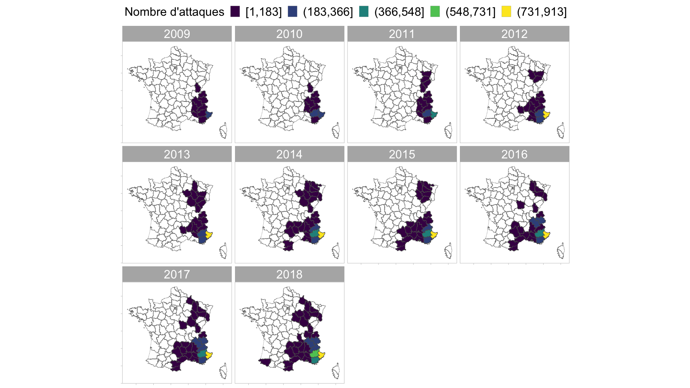
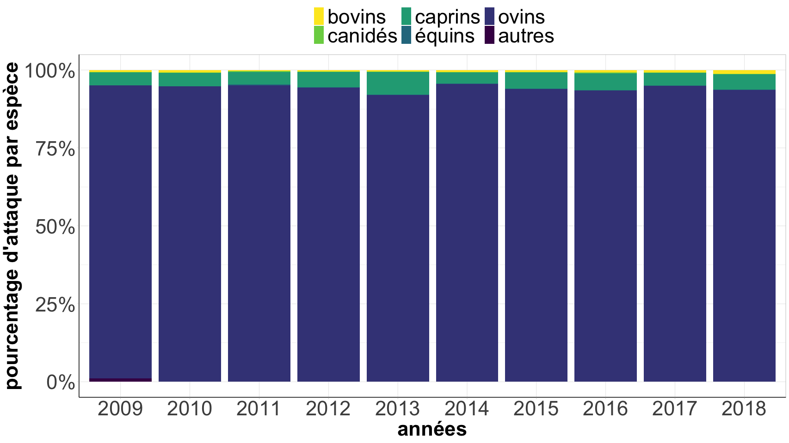
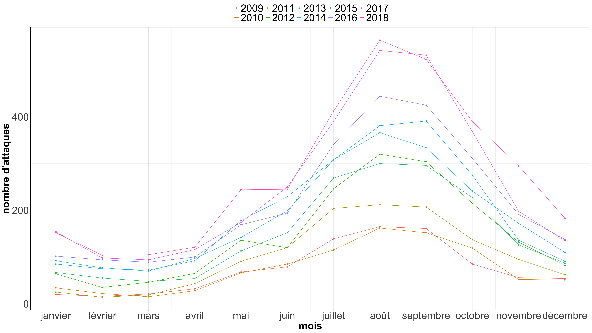
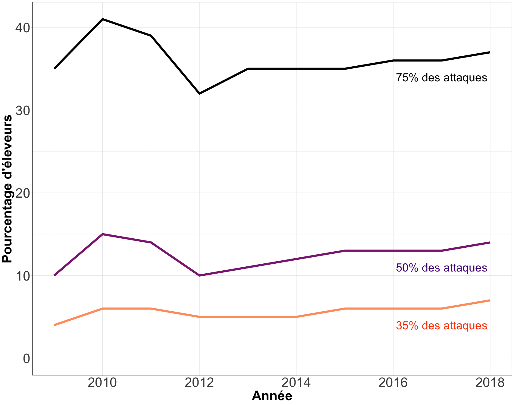
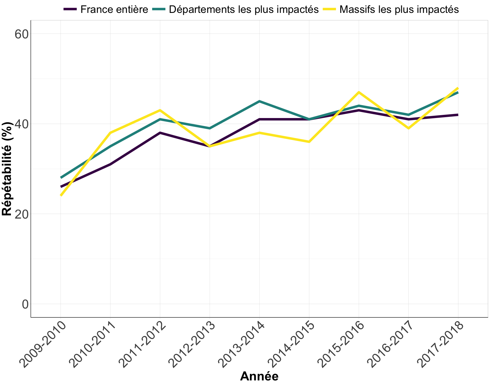

# Etude descriptive du phénomène de concentration des attaques de loup sur les élevages domestiques en France : Analyse de la base de données nationale Géoloup en prélude à un article à publier dans une revue scientifique
### Olivier Gimenez et Olivier Bonnet, mars 2020

# Motivation

Dans ce travail, nous décrivons la proportion d’éleveurs qui concentrent les attaques de loups sur des troupeaux domestiques (ou déprédations) en France. Nous n'analysons pas ici les facteurs qui expliqueraient les variations dans le temps et/ou dans l'espace des patrons de déprédations. 

Nous basons notre analyse sur une extraction nominative effectuée le 15 mai 2019 de la [base de données nationale Géoloup](https://loup.application.developpement-durable.gouv.fr/) pour l'instruction et le suivi des indemnisations des attaques de loups (source des données : DDT / DDTM). Les données ne sont pas publiques, et les droits d’accès à la base de données sont ceux obtenus par l’INRAE-UMR SELMET via une convention signée avec la DREAL AURA le 28 mars 2019. 

La période considérée ici va de 2009 à 2018. Les constats d’attaque retenus sont ceux qualifiés dans la base Géoloup de **Loup non écarté**, quelle que soit l’espèce domestique prédatée. Nous avons qualifié une attaque de la manière suivante :
* Seul les constats répertoriant une victime ou plus sont retenus comme correspondant à une attaque (réussie) ;
* Une attaque constatée sur le troupeau d’un groupement pastoral et impactant les animaux appartenant à plusieurs éleveurs est ici considérée comme une seule et même attaque ;
* Deux constats d’attaque impactant un même troupeau à la même date sont considérés comme provenant d’une seule et même attaque (une attaque peut donner lieu à plusieurs constats si les animaux morts sont retrouvés à plusieurs jours d’intervalle).

# Importation et préparation des données

On importe le jeu de données :

```r
geoloup <- read_csv2('Geoloup_Extraction1992-2018_simple.csv')
```

On procède à un filtrage des données, en ne prenant que les entrées avec le nom de l'éleveur renseigné, et en sélectionnant les lignes avec au moins une victime ; cette dernière manipulation a pour effet de garder une ligne par constat, on considère ainsi qu'un constat est une attaque dans le reste du document. On obtient :

```r
geoloup_processed <- geoloup %>%
  filter(`nom de l'eleveur` != 'INCONNU') %>% # éleveur dont l'id est connue
  rename(nb.victimes.elv = `nb victimes constatees eleveur`,
         nb.bovins = `nb victimes constatees-bovins`,
         nb.canides = `nb victimes constatees-canides`,
         nb.caprins = `nb victimes constatees-caprins`,
         nb.equins = `nb victimes constatees-equins`,
         nb.ovins = `nb victimes constatees-ovins`,
         nb.autres = `nb victimes constatees-autres`,
         nom.eleveur = `nom de l'eleveur`) %>%
  mutate(nom.eleveur = iconv(nom.eleveur, from = "latin1", to = "UTF-8"),
         nom.eleveur = stringi::stri_trans_general(nom.eleveur,"Latin-ASCII"),
         nom.eleveur = tolower(nom.eleveur)) %>%
  mutate(departement = iconv(departement, from = "latin1", to = "UTF-8"),
         departement = stringi::stri_trans_general(departement,"Latin-ASCII"),
         departement = tolower(departement))  %>% # en minuscule
  mutate(massif = iconv(massif, from = "latin1", to = "UTF-8"),
         massif = stringi::stri_trans_general(massif,"Latin-ASCII"),
         massif = tolower(massif)) %>%
  mutate(num.siret = as_factor(SIRET),
         num.constat = as_factor(`numero du constat`),
         nom.eleveur = as_factor(nom.eleveur),
         date.attaque = dmy(`date d'attaque`), # foramt date
         troupeau.prot = as_factor(`Troupeau beneficiant de mesure de protection`)) %>%
  mutate(an = year(date.attaque)) %>% # année de l'attaque
  filter(an > 2008, nb.victimes.elv > 0) %>% # période post-2008 avec au moins une attaque
  select(num.siret, 
         num.constat, 
         nom.eleveur, 
         date.attaque,
         nb.victimes.elv,
         nb.bovins,
         nb.canides,
         nb.caprins,
         nb.equins,
         nb.ovins,
         nb.autres,
         troupeau.prot,
         X,
         Y,
         departement,
         massif,
         an) 
geoloup_france <- add_column(geoloup_processed, scale = 'France entière')
```

On aura aussi besoin du même jeu de données en se concentrant sur les départements les plus impactés, et plus précisément les départements ayant subi au moins 35 attaques par an depuis 2009, à savoir Alpes-de-Haute-Provence, Alpes-Maritimes, Drôme, Hautes-Alpes, Isere et Savoie :

```r
geoloup_dptmt <- geoloup_processed %>%
  filter(departement %in% c('alpes-de-haute-provence','alpes-maritimes','drome','hautes-alpes','isere','savoie','var')) %>%
  add_column(scale = 'Départements les plus impactés')
```

On aura enfin besoin des massifs les plus impactés, et plus précisément les massifs appartenant au département sélectionnées ci-dessus et ayant subi au moins 5 attaques par an depuis 2012, à savoir Alpes Niçoises, Baronnies, Briançonnais, Champsaur, Coteaux de Provence, Coteaux niçois, Devoluy, Diois, Embrunais, Littoral niçois, Maurienne, Montagne de Haute-Povence, Pré-Alpes, Queyras, Région Haute Alpine, Sisteronnais et Tarentaise :

```r
geoloup_msf <- geoloup_processed %>%
  filter(massif %in% c('alpes nicoises',
                       'baronnies',
                       'brianconnais',
                       'champsaur',
                       'coteaux de provence',
                       'coteaux nicois',
                       'devoluy',
                       'diois',
                       'embrunais',
                       'littoral nicois',
                       'maurienne',
                       'montagne de haute-provence',
                       'prealpes',
                       'queyras',
                       'region haute alpine',
                       'sisteronnais',
                       'tarentaise')) %>%
  add_column(scale = 'Massifs les plus impactés')
```

# Résultats

## Combien d'éleveurs sont-ils présents dans la base?

```r
geoloup_processed %>%
  group_by(an) %>%
  summarise(nb.eleveurs = n_distinct(nom.eleveur)) -> tot.eleveurs
tot.eleveurs
```

```
## # A tibble: 10 x 2
##       an nb.eleveurs
##    <dbl>       <int>
##  1  2009         329
##  2  2010         386
##  3  2011         477
##  4  2012         532
##  5  2013         571
##  6  2014         735
##  7  2015         743
##  8  2016         861
##  9  2017         973
## 10  2018        1107
```

## Comment le nombre d'attaques se répartit-il dans le temps?

On représente sur la même figure le nombre d'attaques et le nombre d'éleveurs :

```r
attaques <- rbind(geoloup_france, geoloup_dptmt, geoloup_msf) %>% 
  mutate(an = as_factor(an),
         scale = as_factor(scale)) %>%
  group_by(an, scale) %>% 
  count() %>%
  ggplot(aes(x = an, y = n, fill = scale)) +
  geom_bar(stat = "identity", position = "dodge") +
  scale_fill_viridis(discrete=TRUE, name="") +
  geom_text(
    aes(label = n, y = n), 
    position = position_dodge(width=0.9),
    vjust = -0.25,
    size = 7) +
  ylab("Nombre de constats d'attaque") +
  xlab("Année") +
  theme(axis.title = element_text(face = "bold"),
        axis.title.y = element_text(size = rel(3)),
        axis.title.x = element_text(size = rel(3)),
        axis.text = element_text(size = rel(3)), 
        axis.line = element_line(colour="black"),
        axis.ticks = element_line(),
        legend.position = "top",
        legend.direction = "horizontal",
        legend.text = element_text(size=rel(3)),
        strip.text = element_text(face="bold"))

eleveurs <- tot.eleveurs %>%
    mutate(an = as_factor(an)) %>%
  ggplot(aes(x = an, y = nb.eleveurs, fill = nb.eleveurs)) +
  geom_bar(stat = "identity", position = "dodge") +
  scale_fill_viridis_c(option = 'cividis', direction = -1, name="") +
  geom_text(
    aes(label = nb.eleveurs, y = nb.eleveurs), 
    position = position_dodge(width=0.9),
    vjust = -0.25,
    size = 7) +
  ylab("Nombre d'éleveurs") +
  xlab("Année") +
  theme(axis.title = element_text(face = "bold"),
        axis.title.y = element_text(size = rel(3)),
        axis.title.x = element_text(size = rel(3)),
        axis.text = element_text(size = rel(3)), 
        axis.line = element_line(colour="black"),
        axis.ticks = element_line(),
        legend.position = "",
        legend.direction = "horizontal",
        legend.text = element_text(size=rel(3)),
        strip.text = element_text(face="bold"))
  
attaques / eleveurs
```

<!-- -->

```r
ggsave('fig1.png',dpi=600)
```

## Comment se répartissent les attaques par département?


```r
# on récupère les départements dans l'objet spatial departements_L93
path <- '/Users/oliviergimenez/Dropbox/OG/BOULOT/GENS/Michel MEURET/analyses/departement/'
departements_L93 <- st_read(dsn = path, layer = "DEPARTEMENT",quiet = TRUE) %>% 
  st_transform(2154)

# on formate les attaques par an et par département
geoloup_france %>%
  group_by(an, departement) %>%
  count(sort = TRUE) %>%
  arrange(an, departement) %>%
  mutate(nb.constats = n) -> attaque.an.dptmt

# on met les attaques dans l'objet spatial departements_L93
departements_L93 %>%
  mutate(departement = tolower(NOM_DEPT)) %>%
  left_join(attaque.an.dptmt, by = 'departement') %>%
  mutate(constat.d = cut_interval(nb.constats, 5),
         constat.d = fct_explicit_na(constat.d, '0')) %>%
  filter(constat.d != '0') -> dpt_constats

# on visualise
ggplot() +
  geom_sf(data = st_boundary(departements_L93), lwd = 0.1, color = 'grey50') + 
  geom_sf(data = dpt_constats, aes(fill = constat.d), lwd = 0.1) + 
  scale_fill_viridis_d(name = 'Nombre d\'attaques') +
  coord_sf(crs = 2154, datum = sf::st_crs(2154)) +
  theme(axis.text.x = element_blank(),
        axis.text.y = element_blank(),
        panel.grid.major = element_blank(),
        panel.grid.minor = element_blank(),
        legend.position = 'top',
        legend.direction = "horizontal",
        legend.text = element_text(size=rel(2)),
        legend.title = element_text(size=rel(2)),
        strip.text = element_text(size=rel(2))) +
  facet_wrap(~an)
```

<!-- -->

## Comment les attaques se répartissent-elles entre ovins, bovins, canidés, caprins, équins et autres?


```r
geoloup_france %>%
  select(starts_with("nb."), - nb.victimes.elv, an) %>%
  pivot_longer(
    starts_with('nb.'),
    names_to = 'espece',
    values_to = 'nb.attaques') %>%
  mutate(an = as_factor(an),
         espece = as_factor(espece)) %>%
  group_by(espece, an) %>%
  summarise(somme = sum(nb.attaques)) %>%
  ggplot() + 
  geom_col(aes(an, somme, fill = espece), position = 'fill') +
  scale_fill_viridis(discrete = TRUE,
                     name="",
                     labels= c("bovins", "canidés", "caprins", "équins", "ovins", "autres"),
                     direction = -1) +
  scale_y_continuous(labels=percent_format()) + 
  xlab("années") + 
  ylab("pourcentage d'attaque par espèce") + 
  theme(axis.title = element_text(face = "bold"),
        axis.title.y = element_text(size = rel(3)),
        axis.title.x = element_text(size = rel(3)),
        axis.text = element_text(size = rel(3)), 
        axis.line = element_line(colour="black"),
        axis.ticks = element_line(),
        legend.position = "top",
        legend.direction = "horizontal",
        legend.text = element_text(size=rel(3)),
        strip.text = element_text(face="bold"))
```

<!-- -->

## Quand dans l’année les attaques ont-elles lieu?


```r
geoloup_france %>%
  mutate(mois = month(date.attaque),
         an = as.character(year(date.attaque))) %>%
  group_by(an,mois) %>%
  count() %>%
  ggplot(aes(x = mois, y = n, color = an)) +
  geom_line() +
  geom_point() + 
  scale_x_continuous(breaks = 1:12, labels = c("janvier",
                              "février",
                              "mars",
                              "avril",
                              "mai",
                              "juin",
                              "juillet",
                              "août",
                              "septembre",
                              "octobre",
                              "novembre",
                              "décembre")) + 
  labs(x = "mois",
       y = "nombre d'attaques",
       color="") + 
  theme(axis.title = element_text(face = "bold"),
        axis.title.y = element_text(size = rel(3)),
        axis.title.x = element_text(size = rel(3)),
        axis.text = element_text(size = rel(3)), 
        axis.line = element_line(colour="black"),
        axis.ticks = element_line(),
        legend.position = "top",
        legend.direction = "horizontal",
        legend.text = element_text(size=rel(3)),
        strip.text = element_text(face="bold"))
```

<!-- -->

## Quelles proportions d'éleveurs concentrent la majorité des attaques? 

Nous nous intéressons ici à la proportion d'éleveurs qui concentrent une majorité des attaques. Nous considérons 3 seuils pour définir cette majorité : 35%, 50% et 75%. 

Commençons par 35%, et demandons-nous quels sont les éleveurs qui concentrent 35% des attaques chaque année?

```r
geoloup_france %>%
  group_by(an, nom.eleveur) %>% 
  summarize(nb.constats = n_distinct(num.constat)) %>%
  mutate(prop.attaque = nb.constats / sum(nb.constats)) %>%
  arrange(an,desc(prop.attaque)) %>%
  mutate(cumsum = cumsum(prop.attaque)) %>%
  filter(cumsum < 0.35) -> eleveurs35

eleveurs35 %>%
  left_join(tot.eleveurs, by = 'an') %>%
  group_by(an) %>%
  mutate(nb.eleveurs.an = n_distinct(nom.eleveur),
         prop.eleveurs = nb.eleveurs.an / nb.eleveurs) %>%
  slice(1) %>%
  select(prop.eleveurs) -> prop35
prop35
```

```
## # A tibble: 10 x 2
## # Groups:   an [10]
##       an prop.eleveurs
##    <dbl>         <dbl>
##  1  2009        0.0426
##  2  2010        0.0648
##  3  2011        0.0629
##  4  2012        0.0451
##  5  2013        0.0525
##  6  2014        0.0531
##  7  2015        0.0592
##  8  2016        0.0616
##  9  2017        0.0647
## 10  2018        0.0687
```

Idem pour 50% : 

```r
geoloup_france %>%
  group_by(an, nom.eleveur) %>% 
  summarize(nb.constats = n_distinct(num.constat)) %>%
  mutate(prop.attaque = nb.constats / sum(nb.constats)) %>%
  arrange(an,desc(prop.attaque)) %>%
  mutate(cumsum = cumsum(prop.attaque)) %>%
  filter(cumsum < 0.50) -> eleveurs50

eleveurs50 %>%
  left_join(tot.eleveurs, by = 'an') %>%
  group_by(an) %>%
  mutate(nb.eleveurs.an = n_distinct(nom.eleveur),
         prop.eleveurs = nb.eleveurs.an / nb.eleveurs) %>%
  slice(1) %>%
  select(prop.eleveurs) -> prop50
prop50
```

```
## # A tibble: 10 x 2
## # Groups:   an [10]
##       an prop.eleveurs
##    <dbl>         <dbl>
##  1  2009        0.103 
##  2  2010        0.148 
##  3  2011        0.136 
##  4  2012        0.0959
##  5  2013        0.112 
##  6  2014        0.117 
##  7  2015        0.125 
##  8  2016        0.128 
##  9  2017        0.129 
## 10  2018        0.139
```

Et enfin 75% : 

```r
geoloup_france %>%
  group_by(an, nom.eleveur) %>% 
  summarize(nb.constats = n_distinct(num.constat)) %>%
  mutate(prop.attaque = nb.constats / sum(nb.constats)) %>%
  arrange(an,desc(prop.attaque)) %>%
  mutate(cumsum = cumsum(prop.attaque)) %>%
  filter(cumsum < 0.75) -> eleveurs75

eleveurs75 %>%
  left_join(tot.eleveurs, by = 'an') %>%
  group_by(an) %>%
  mutate(nb.eleveurs.an = n_distinct(nom.eleveur),
         prop.eleveurs = nb.eleveurs.an / nb.eleveurs) %>%
  slice(1) %>%
  select(prop.eleveurs) -> prop75
prop75
```

```
## # A tibble: 10 x 2
## # Groups:   an [10]
##       an prop.eleveurs
##    <dbl>         <dbl>
##  1  2009         0.350
##  2  2010         0.415
##  3  2011         0.386
##  4  2012         0.323
##  5  2013         0.345
##  6  2014         0.354
##  7  2015         0.353
##  8  2016         0.365
##  9  2017         0.360
## 10  2018         0.367
```

On visualise ces résultats :

```r
prop75 %>% 
  left_join(prop50, by = 'an') %>%
  left_join(prop35, by = 'an') %>%
  rename(`75%` = prop.eleveurs.x, `50%` = prop.eleveurs.y, `35%` = prop.eleveurs) %>%
  pivot_longer(-an, names_to = 'seuil', values_to = 'pourcentage') %>%
  ggplot(aes(an, round(pourcentage*100), color = seuil, group = seuil, )) +
  geom_line(size=3) +
  scale_color_viridis(discrete = TRUE, option = 'magma', end = 0.8, direction = -1) +
  expand_limits(y = 0) +
  xlab("Année") + 
  ylab("Pourcentage d'éleveurs") + 
  theme(axis.title = element_text(face = "bold"),
        axis.title.y = element_text(size = rel(3)),
        axis.title.x = element_text(size = rel(3)),
        axis.text = element_text(size = rel(3)), 
        axis.line = element_line(colour="black"),
        axis.ticks = element_line(),
        legend.position = "",
        legend.direction = "horizontal",
        legend.text = element_text(size=rel(3)),
        strip.text = element_text(face="bold")) + 
  annotate(geom = "text", x = 2017, y = 34, label="75% des attaques",
              color="black", size= 10) + 
  annotate(geom = "text", x = 2017, y = 11, label="50% des attaques",
              color="purple4", size= 10) + 
  annotate(geom = "text", x = 2017, y = 4, label="35% des attaques",
              color="orangered", size= 10)
```

<!-- -->

```r
ggsave('fig2.png',dpi=600)
```

## Quelle est la proportion d'éleveurs attaqués d'une année sur l'autre?

On s'intéresse ici à la répétabilité des attaques. On calcule le ratio entre le nombre d'éleveurs en commun entre une année et l'année suivante et le nombre d'éleveurs total des deux années, pour les 3 échelles considérées : 

```r
geoloup_france %>% 
#  mutate(nom.eleveur = fct_anon(nom.eleveur)) %>% # on anonymise le nom des éleveurs
  group_by(an, nom.eleveur) %>% 
  summarize(nb.constats = n_distinct(num.constat)) %>%
  mutate(prop.attaque = nb.constats / sum(nb.constats)) %>%
  arrange(an,desc(prop.attaque)) %>%
  mutate(cumsum = cumsum(prop.attaque)) %>%
  filter(cumsum < 0.35) %>%
  mutate(nom.eleveur = str_replace_all(nom.eleveur,"[^[:graph:]]", " ")) %>%
  mutate(nom.eleveur = tolower(nom.eleveur)) %>%
  arrange(an, nom.eleveur) %>%
  mutate(id = row_number()) %>%
  pivot_wider(names_from = an, 
              values_from = nom.eleveur, 
              -c(nb.constats,prop.attaque,cumsum)) -> eleveurs.an.france

geoloup_dptmt %>% 
#  mutate(nom.eleveur = fct_anon(nom.eleveur)) %>% # on anonymise le nom des éleveurs
  group_by(an, nom.eleveur) %>% 
  summarize(nb.constats = n_distinct(num.constat)) %>%
  mutate(prop.attaque = nb.constats / sum(nb.constats)) %>%
  arrange(an,desc(prop.attaque)) %>%
  mutate(cumsum = cumsum(prop.attaque)) %>%
  filter(cumsum < 0.35) %>%
  mutate(nom.eleveur = str_replace_all(nom.eleveur,"[^[:graph:]]", " ")) %>%
  mutate(nom.eleveur = tolower(nom.eleveur)) %>%
  arrange(an, nom.eleveur) %>%
  mutate(id = row_number()) %>%
  pivot_wider(names_from = an, 
              values_from = nom.eleveur, 
              -c(nb.constats,prop.attaque,cumsum)) -> eleveurs.an.dptmt

geoloup_msf %>% 
#  mutate(nom.eleveur = fct_anon(nom.eleveur)) %>% # on anonymise le nom des éleveurs
  group_by(an, nom.eleveur) %>% 
  summarize(nb.constats = n_distinct(num.constat)) %>%
  mutate(prop.attaque = nb.constats / sum(nb.constats)) %>%
  arrange(an,desc(prop.attaque)) %>%
  mutate(cumsum = cumsum(prop.attaque)) %>%
  filter(cumsum < 0.35) %>%
  mutate(nom.eleveur = str_replace_all(nom.eleveur,"[^[:graph:]]", " ")) %>%
  mutate(nom.eleveur = tolower(nom.eleveur)) %>%
  arrange(an, nom.eleveur) %>%
  mutate(id = row_number()) %>%
  pivot_wider(names_from = an, 
              values_from = nom.eleveur, 
              -c(nb.constats,prop.attaque,cumsum)) -> eleveurs.an.msf

ratio <- NULL
df.eleveurs.an <- data.frame(eleveurs.an.france)
for (i in 2:10){
  ratio <- c(ratio, sum(!is.na(intersect(df.eleveurs.an[,i],df.eleveurs.an[,i+1]))) /
    sum(!is.na(union(df.eleveurs.an[,i],df.eleveurs.an[,i+1]))))
}
ratio_france <- as_tibble(ratio) %>%
  add_column(an = c('2009-2010',
                       '2010-2011',
                       '2011-2012',
                       '2012-2013',
                       '2013-2014',
                       '2014-2015',
                       '2015-2016',
                       '2016-2017',
                       '2017-2018'),
             scale = 'France entière')
ratio_france
```

```
## # A tibble: 9 x 3
##   value an        scale         
##   <dbl> <chr>     <chr>         
## 1 0.258 2009-2010 France entière
## 2 0.310 2010-2011 France entière
## 3 0.385 2011-2012 France entière
## 4 0.35  2012-2013 France entière
## 5 0.408 2013-2014 France entière
## 6 0.407 2014-2015 France entière
## 7 0.426 2015-2016 France entière
## 8 0.415 2016-2017 France entière
## 9 0.418 2017-2018 France entière
```

```r
ratio <- NULL
df.eleveurs.an <- data.frame(eleveurs.an.dptmt)
for (i in 2:10){
  ratio <- c(ratio, sum(!is.na(intersect(df.eleveurs.an[,i],df.eleveurs.an[,i+1]))) /
    sum(!is.na(union(df.eleveurs.an[,i],df.eleveurs.an[,i+1]))))
}
ratio_dptmt <- as_tibble(ratio) %>%
  add_column(an = c('2009-2010',
                       '2010-2011',
                       '2011-2012',
                       '2012-2013',
                       '2013-2014',
                       '2014-2015',
                       '2015-2016',
                       '2016-2017',
                       '2017-2018'),
             scale = 'Départements les plus impactés')
ratio_dptmt
```

```
## # A tibble: 9 x 3
##   value an        scale                         
##   <dbl> <chr>     <chr>                         
## 1 0.276 2009-2010 Départements les plus impactés
## 2 0.351 2010-2011 Départements les plus impactés
## 3 0.406 2011-2012 Départements les plus impactés
## 4 0.394 2012-2013 Départements les plus impactés
## 5 0.45  2013-2014 Départements les plus impactés
## 6 0.408 2014-2015 Départements les plus impactés
## 7 0.439 2015-2016 Départements les plus impactés
## 8 0.418 2016-2017 Départements les plus impactés
## 9 0.474 2017-2018 Départements les plus impactés
```

```r
ratio <- NULL
df.eleveurs.an <- data.frame(eleveurs.an.msf)
for (i in 2:10){
  ratio <- c(ratio, sum(!is.na(intersect(df.eleveurs.an[,i],df.eleveurs.an[,i+1]))) /
    sum(!is.na(union(df.eleveurs.an[,i],df.eleveurs.an[,i+1]))))
}
ratio_msf <- as_tibble(ratio) %>%
  add_column(an = c('2009-2010',
                       '2010-2011',
                       '2011-2012',
                       '2012-2013',
                       '2013-2014',
                       '2014-2015',
                       '2015-2016',
                       '2016-2017',
                       '2017-2018'),
             scale = 'Massifs les plus impactés')
ratio_msf
```

```
## # A tibble: 9 x 3
##   value an        scale                    
##   <dbl> <chr>     <chr>                    
## 1 0.24  2009-2010 Massifs les plus impactés
## 2 0.375 2010-2011 Massifs les plus impactés
## 3 0.429 2011-2012 Massifs les plus impactés
## 4 0.355 2012-2013 Massifs les plus impactés
## 5 0.385 2013-2014 Massifs les plus impactés
## 6 0.362 2014-2015 Massifs les plus impactés
## 7 0.471 2015-2016 Massifs les plus impactés
## 8 0.387 2016-2017 Massifs les plus impactés
## 9 0.485 2017-2018 Massifs les plus impactés
```

Visualisons maintenant cette quantité : 

```r
bind_rows(ratio_france,ratio_dptmt,ratio_msf) %>%
  mutate(scale = as_factor(scale)) %>%
  ggplot(aes(x = an, y = round(value*100), color = scale, group = scale)) +
  geom_line(size=3) +
  scale_color_viridis(discrete = TRUE) +
  expand_limits(y = c(0,80)) +
  xlab("Année") + 
  ylab("Répétabilité (%)") +
  labs(color='') +
  theme(axis.title = element_text(face = "bold"),
        axis.title.y = element_text(size = rel(4)),
        axis.title.x = element_text(size = rel(4)),
        axis.text = element_text(size = rel(4)), 
        axis.line = element_line(colour="black"),
        axis.ticks = element_line(),
        legend.position = "top",
        legend.direction = "horizontal",
        legend.text = element_text(size=rel(4)),
        legend.key.width=unit(3,"line"),
        strip.text = element_text(face="bold"),
        axis.text.x = element_text(angle = 45, hjust = 1))
```

<!-- -->

```r
ggsave('fig3.png',dpi=600)
```

## Quel est le nombre d'éleveurs attaqués 1 fois, 2 fois, etc...? 

On calcule ce nombre pour la France entière, puis les départements et les massifs les plus impactés : 

```r
geoloup_france %>%
#  mutate(nom.eleveur = fct_anon(nom.eleveur)) %>% # on anonymise le nom des éleveurs
  group_by(an, nom.eleveur) %>% 
  summarize(nb.constats = n_distinct(num.constat)) %>%
  mutate(prop.attaque = nb.constats / sum(nb.constats)) %>%
  arrange(an,desc(prop.attaque)) %>%
  mutate(cumsum = cumsum(prop.attaque)) %>%
  filter(cumsum < 0.35) %>%
#  mutate(nom.eleveur = str_replace_all(nom.eleveur,"[^[:graph:]]", " ")) %>%
  group_by(nom.eleveur) %>%
  count() %>%
  group_by(n) %>%
  count() %>%
  add_column(scale = 'France entière') -> unik_france

geoloup_dptmt %>%
#  mutate(nom.eleveur = fct_anon(nom.eleveur)) %>% # on anonymise le nom des éleveurs
  group_by(an, nom.eleveur) %>% 
  summarize(nb.constats = n_distinct(num.constat)) %>%
  mutate(prop.attaque = nb.constats / sum(nb.constats)) %>%
  arrange(an,desc(prop.attaque)) %>%
  mutate(cumsum = cumsum(prop.attaque)) %>%
  filter(cumsum < 0.35) %>%
#  mutate(nom.eleveur = str_replace_all(nom.eleveur,"[^[:graph:]]", " ")) %>%
  group_by(nom.eleveur) %>%
  count() %>%
  group_by(n) %>%
  count() %>%
  add_column(scale = 'Départements les plus impactés') -> unik_dptmt

geoloup_msf %>%
#  mutate(nom.eleveur = fct_anon(nom.eleveur)) %>% # on anonymise le nom des éleveurs
  group_by(an, nom.eleveur) %>% 
  summarize(nb.constats = n_distinct(num.constat)) %>%
  mutate(prop.attaque = nb.constats / sum(nb.constats)) %>%
  arrange(an,desc(prop.attaque)) %>%
  mutate(cumsum = cumsum(prop.attaque)) %>%
  filter(cumsum < 0.35) %>%
#  mutate(nom.eleveur = str_replace_all(nom.eleveur,"[^[:graph:]]", " ")) %>%
  group_by(nom.eleveur) %>%
  count() %>%
  group_by(n) %>%
  count() %>%
  add_column(scale = 'Massifs les plus impactés')-> unik_msf

unik <- bind_rows(unik_france, unik_dptmt, unik_msf) %>%
  mutate(scale = as_factor(scale))
unik
```

```
## # A tibble: 30 x 3
## # Groups:   n [10]
##        n    nn scale         
##    <int> <int> <fct>         
##  1     1    85 France entière
##  2     2    22 France entière
##  3     3    18 France entière
##  4     4     9 France entière
##  5     5     5 France entière
##  6     6     7 France entière
##  7     7     2 France entière
##  8     8     5 France entière
##  9     9     2 France entière
## 10    10     4 France entière
## # … with 20 more rows
```

```r
unik %>%
  ggplot(aes(x = as_factor(n), y = nn, fill = scale)) +
  geom_bar(stat = "identity", position = "dodge") +
  scale_fill_viridis(discrete=TRUE, name="") +
  geom_text(
    aes(label = nn, y = nn), 
    position = position_dodge(width=0.9),
    vjust = -0.25,
    size = 10) +
  ylab("Nombre d'éleveurs") +
  xlab("Nombre d'occurrences") +
  theme(panel.background = element_rect(colour = NA),
        plot.background = element_rect(colour = NA),
        panel.border = element_rect(colour = NA),
        axis.title = element_text(face = "bold",size = rel(4)),
        axis.title.y = element_text(angle=90,vjust=2),
        axis.title.x = element_text(vjust = -0.2),
        axis.text = element_text(size = rel(4)), 
        axis.line = element_line(colour="black"),
        axis.ticks = element_line(),
        panel.grid.major = element_line(colour="#f0f0f0"),
        panel.grid.minor = element_blank(),
        legend.key = element_rect(colour = NA),
        legend.position = "top",
        legend.direction = "horizontal",
        legend.text = element_text(size=rel(4)),
        plot.margin=unit(c(10,5,5,5),"mm"),
        strip.background=element_rect(colour="#f0f0f0",fill="#f0f0f0"),
        strip.text = element_text(face="bold")) 
```

<!-- -->

```r
ggsave('fig4.png',dpi=600)
```

Pour déterminer quelles proportions ces nombres représentent, nous avons besoin du nombre total d'éleveurs parmi les 35% pour la France : 

```r
length(unique(eleveurs35$nom.eleveur))
```

```
## [1] 159
```

Même chose pour les départements les plus impactés :

```r
geoloup_dptmt %>%
  group_by(an, nom.eleveur) %>% 
  summarize(nb.constats = n_distinct(num.constat)) %>%
  mutate(prop.attaque = nb.constats / sum(nb.constats)) %>%
  arrange(an,desc(prop.attaque)) %>%
  mutate(cumsum = cumsum(prop.attaque)) %>%
  filter(cumsum < 0.35) -> eleveurs35dptmt
length(unique(eleveurs35dptmt$nom.eleveur))
```

```
## [1] 124
```

Et les massifs les plus impactés :

```r
geoloup_msf %>%
  group_by(an, nom.eleveur) %>% 
  summarize(nb.constats = n_distinct(num.constat)) %>%
  mutate(prop.attaque = nb.constats / sum(nb.constats)) %>%
  arrange(an,desc(prop.attaque)) %>%
  mutate(cumsum = cumsum(prop.attaque)) %>%
  filter(cumsum < 0.35) -> eleveurs35msf
length(unique(eleveurs35msf$nom.eleveur))
```

```
## [1] 110
```

# Version utilisée de `R` et des packages


```r
sessionInfo()
```

```
## R version 3.6.2 (2019-12-12)
## Platform: x86_64-apple-darwin15.6.0 (64-bit)
## Running under: macOS Catalina 10.15.3
## 
## Matrix products: default
## BLAS:   /Library/Frameworks/R.framework/Versions/3.6/Resources/lib/libRblas.0.dylib
## LAPACK: /Library/Frameworks/R.framework/Versions/3.6/Resources/lib/libRlapack.dylib
## 
## locale:
## [1] fr_FR.UTF-8/fr_FR.UTF-8/fr_FR.UTF-8/C/fr_FR.UTF-8/fr_FR.UTF-8
## 
## attached base packages:
## [1] stats     graphics  grDevices utils     datasets  methods   base     
## 
## other attached packages:
##  [1] patchwork_1.0.0   sf_0.8-1          vegan_2.5-6       lattice_0.20-38  
##  [5] permute_0.9-5     viridis_0.5.1     viridisLite_0.3.0 ggrepel_0.8.2    
##  [9] scales_1.1.0      lubridate_1.7.4   forcats_0.5.0     stringr_1.4.0    
## [13] dplyr_0.8.5       purrr_0.3.3       readr_1.3.1       tidyr_1.0.2      
## [17] tibble_2.1.3      ggplot2_3.3.0     tidyverse_1.3.0  
## 
## loaded via a namespace (and not attached):
##  [1] httr_1.4.1         jsonlite_1.6.1     splines_3.6.2      modelr_0.1.6      
##  [5] assertthat_0.2.1   cellranger_1.1.0   yaml_2.2.1         pillar_1.4.3      
##  [9] backports_1.1.5    glue_1.3.2         digest_0.6.25      rvest_0.3.5       
## [13] colorspace_1.4-1   htmltools_0.4.0    Matrix_1.2-18      pkgconfig_2.0.3   
## [17] broom_0.5.5        haven_2.2.0        mgcv_1.8-31        farver_2.0.3      
## [21] generics_0.0.2     ellipsis_0.3.0     withr_2.1.2        cli_2.0.2         
## [25] magrittr_1.5       crayon_1.3.4       readxl_1.3.1       evaluate_0.14     
## [29] fs_1.3.2           fansi_0.4.1        nlme_3.1-142       MASS_7.3-51.4     
## [33] xml2_1.2.2         class_7.3-15       tools_3.6.2        hms_0.5.3         
## [37] lifecycle_0.2.0    munsell_0.5.0      reprex_0.3.0       cluster_2.1.0     
## [41] compiler_3.6.2     e1071_1.7-3        rlang_0.4.5        classInt_0.4-2    
## [45] units_0.6-5        grid_3.6.2         rstudioapi_0.11    labeling_0.3      
## [49] rmarkdown_2.1      gtable_0.3.0       codetools_0.2-16   DBI_1.1.0         
## [53] R6_2.4.1           gridExtra_2.3      knitr_1.28         KernSmooth_2.23-16
## [57] stringi_1.4.6      parallel_3.6.2     Rcpp_1.0.4         vctrs_0.2.4       
## [61] dbplyr_1.4.2       tidyselect_1.0.0   xfun_0.12
```
